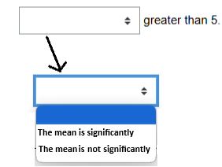

# Summary

``pyequa`` is a Python package that provides a simple and efficient way to create multiple Cloze quizzes for Moodle  [@moodlecloze], allowing educators to generate dozens of interactive exercises quickly and easily. 

An author needs this files:

* `exercise_model.md`: a markdown file (with text, figures, or tables) containing all variables declared like `{variable}`; later, in the generated quizzes, a variable can be "given" in text, or can be converted to a "fill-in-the-blank" (multiple choice or numerical);
* `data.csv`: a csv, or xlsx, file containing values or texts for variables; each row contains values that turns text in exercise model in a complete instance of some scientific scenario;
* `produce.py`: a Python file containing two string declarations :
  * `scenario_relations` : a multi-line string, with all relations between variables in a scenario; an example is 'Eq(mean, (x1+x2+x3)/3';
  * `variable_attributes`: type (numerical or multiple choice), tolerance (if numerical), optional output level (above 'mean' has level 2).

As an example follows, for basic statistics. The file `exercise_model.md` contains:

```markdown
Consider this sample,
\(x\_1\)={x1}
\(x\_2\)={x2}
\(x\_3\)={x3}
and based on it, the following statistics are calculated:
\(\bar x\) = {mean}
\(s\_c^2\) = {variance}
variation coefficient = {cv}
```

Notice the "declarative" way of writting an exercise model.

Then, a data file, named `data.csv`, is created with columns 'x1', 'x2', 'x3', 'mean', 'variance', 'cv'. Values can be produced by hand or using code.

File `produce.py` contains this declarations:

```python
scenario_relations = {
    "Eq(mean,  (x1+x2+x3)/3 )",
    "Eq(variance, ( (x1-mean)**2 + (x2-mean)**2 + (x3-mean)**2 )/2 )",
    "Eq(cv,   sqrt(variance)/mean)",
}

variable_attributes = {
    "x1":   {"type": "numerical", "tol": 0.05,  "givenvarlevel": 1},
    "x2":   {"type": "numerical", "tol": 0.05,  "givenvarlevel": 1},
    "x3":   {"type": "numerical", "tol": 0.05,  "givenvarlevel": 1},
    "mean": {"type": "numerical", "tol": 0.05,  "givenvarlevel": 2},
    "variance": {"type": "numerical", "tol": 0.05,  "givenvarlevel": 2},
    "cv":   {"type": "numerical", "tol": 0.05,  "givenvarlevel": 3},
}
```

A teacher can create several quizzes, in three main ways: 

* evaluation quizzes, 
* exploratory quizzes showing all combinations of  "given" variables" versus "fill-in-the-blanks" variables, and 
* "hard first" quizzes.

**Evaluation quizzes .** A teacher can produce questions for a moment of evaluation using Moodle "random question" (randomly selecting a quiz from a set of several similar quizzes). In ``pyequa``, this is done inside `produce.py` with function `randomquestion_sameblanks()` as in the example:

```python
randomquestion_sameblanks( fill_in_blanks_vars = {'mean', 'variance'}, 
	                       number_of_problems_per_givenvars=4 )
```

The instruction produces 4 quizzes, all with two numerical fill-in-the-blanks (`mean` and `variance`) and values are given to all other variables (`x1`, `x2`, `x3`, `cv`). 

**Exploratory quizzes.** A second method to produce quizzes helps the teacher to check diverse quizzes. All combinations of "given" variables" versus "fill-in-the-blanks" variables, in student text, are made. Eventually, a teacher can select some for class. In ``pyequa``, this is done inside `produce.py` file with function `exploratory()`  as in the example:

```python
exploratory()  #no arguments
```

**Hard first quizzes.** An illustration of the concept "hard first" goes as follow: all calculators can easily compute the mean of a three element sample but if, in another quiz, the `mean` is given and only the element `x2` has to be calculated, the student must know how to use the arithmetic mean expression to get `x2`. The inverse problem are usually harder and it could be posed as a challenge to students. The instruction to do that is:

```python
hard_first( max_number_of_problems=10, 
            max_combinations_givenvars_per_easynesslevel=3, 
            number_of_problems_per_givenvars=1)
```

It generates at most 10 problems, all with 1, 2 or 3 variables given (the others are fill-in-the-blanks), and for each combination of "given" variables" versus "fill-in-the-blanks" variables, only 1 quiz is generated.

Some notes:

* The output of this instructions is a folder `_output_` in two formats: markdown and xml for Moodle import.
* The authors use the package ``pyequa`` in VSCode and RStudio to produce quizzes for introductory courses in numerics and statistics.
* Data files (`data.csv` as explained previously) have been written by hand (carefully chosen interesting values or text strings for quizzes), or was coded in Python, R, or using Excel functions.
* If a column in data file has text, it will be implemented as a multiple choice field in Moodle like shown in the image:



# Citations

Inspiration for this work came from a talk with authors of  @Araujo+Almeida+Smirnov:2016 where they dissect the notion of "Exercise composition". The same authors, in the related work @Araujo+Smirnov+Almeida:2015, explore the case where a scenario is built of polynomials to be worked by Gröbner bases.

A previous work from first author [@Cruz+Oliveira+Seabra:2012] was also an inspiration for this Python package.

Package is available at @pyequa:2025 that produces Moodle Cloze quizzes [@moodlecloze]. Package folder "examples" got several cases.

# Statement of Need

Manual creation of parameterized quizzes, even with help of small chunks of code, can be a time-consuming and laborious process for teachers. A tool is introduced that eases the construction of quizzes for Moodle as these are an usual way for a student to practice concepts in STEM fields or being evaluated. 

# Acknowledgements

João Pedro Cruz is supported by The Center for Research and Development in Mathematics and Applications (CIDMA) through the Portuguese Foundation for Science and Technology (FCT – Fundação para a Ciência e a Tecnologia), reference UIDB/04106/2020 (https://doi.org/10.54499/UIDB/04106/2020).

Joaquim Gomes is supported by INAGBE (Governo de Angola):


	

# References


